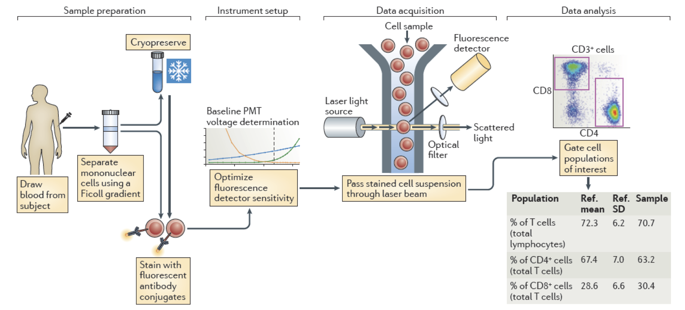
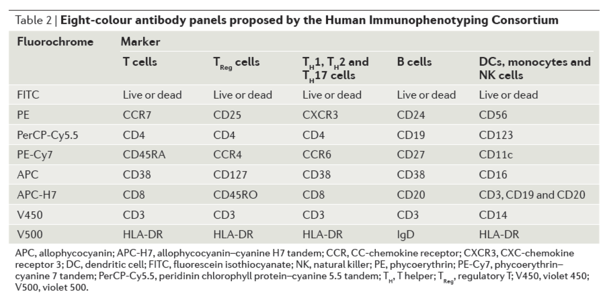
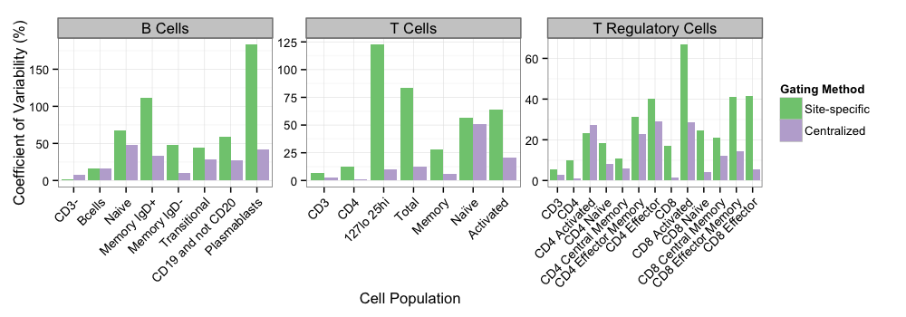
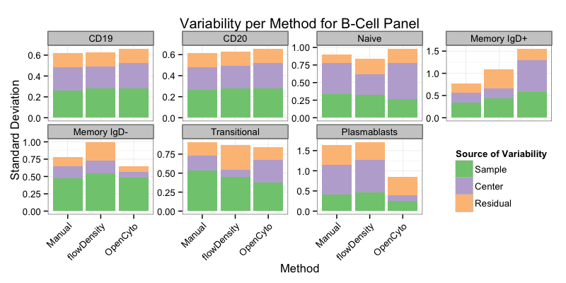
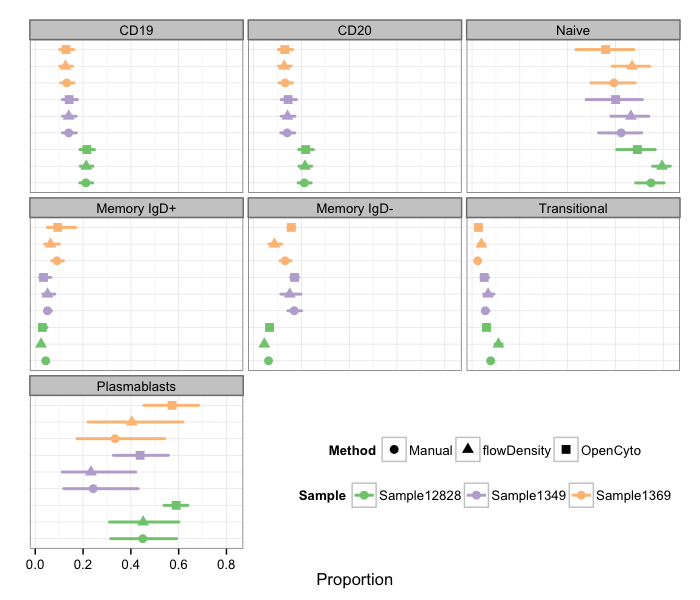
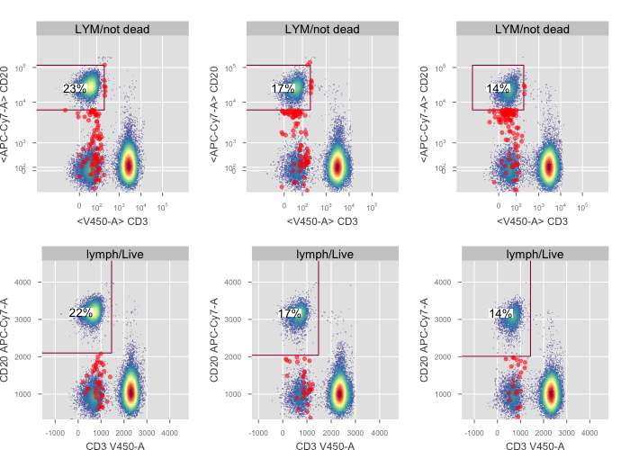
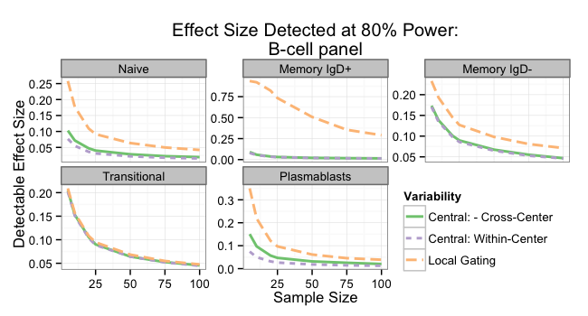

## Why standardize?
Extremely important for clinical trials.

* We want reproducibile results.
* We want to be able to compare data generated from different sites.
    * maybe even from different trials.
* Reduce biases from manual analysis.
* Decrease variability and improve statsitical power to detect biological differences (*ultimately lower costs*).

**Must ensure we are measuring biological signals, not technical noise.**

> The accurate measurement of variations in the human immune system requires precise and standardized assays to distinguish true biological changes from technical artefacts .. Flow cytometry .. remains highly variable with regard to sample handling, reagents, instrument setup and data analysis. 

<cite>- Maecker *et al.*, *Nature Reviews Immunology (March 2012)*</cite>

## Many Variables in the Flow Cytometry Workflow

Standardizing reagents, SOPs, and analysis = comparable data? 

<reference>Holden T. Maecker, J. Philip McCoy & Robert Nussenblatt, *Nature Reviews Immunology 12, 191-200 (March 2012)*</reference>

<slidethanks>Phil McCoy</slidethanks>

## Lyoplates Built to Standardize Reagents and Handling
A consortium of academic and industry groups interested in standardizing immunophenotyping of human samples.

<emph>Standardized Lyoplate Staining Panels Developed at FITMaN Conference, Feb 2012</emph>

<reference>Holden T. Maecker, J. Philip McCoy & Robert Nussenblatt, *Nature Reviews Immunology 12, 191-200 (March 2012)*</reference>

## SOP's Improved over Multiple Iterations {.smaller}
<emph2>Lyoplate 1.0</emph2>  

* 9 participating sites. 2 aliquots of 3 biological samples of cryopreserved cells run a total of six times at each site.
    * Inconsitencies in cryopreservation across sites introduced too much noise.
    * Highlighted need for harmonizing cryopreservation/thawing among sites for comparing clinical trial data.
    
<emph2>Lyoplate 2.0</emph2>   

* 9 sites, 4 samples of Cytotrol control cells.
    * Data gated centrally using a "consensus" gating strategy.
    * Two panels submitted to FlowCAP III workshop as a challenge.
        * Some automated gating approaches performed well, but highlighted some poorly resolved markers and problems with SOPs.

## Lyoplates 3.0 - Standardizing and Automating Data Analysis

Lyoplate 1.0 - 2.0 - **centralized analysis substantially reduced variability** compared to center-specific gating.

- Central analysis not feasible as a systematic approach for large multi-center trials.

**Lyoplate 3.0**

* <emph2>Can automated data analysis compete favorably?</emph2>  

## Lyoplate 3.0 - Study Design {.smaller}  

|Panels| Replicates| Biological Samples| Centers|Total FCS Files|Gating Methods|
|:------:|:-----------:|:-----------------:|:--------:|:---------:|:------|
|B-cell T-cell T-reg DC/Mono/NK T-helper  |3          |3 Samples of SeraCare Cells                 |9       |$5\times3\times3\times9=405$      |Central manual vs. automated|

Each panel gated centrally via a consensus gating strategy.  
Automated pipelines devised to <emph>mimic</emph> the consensus strategy <emph>blinded to the manual results</emph>.

<h3> Comparison of Gating Methods </h3>
Decompose the variability due to <emph>center</emph>, <emph>biological sample</emph> and <emph>residual technical variability</emph>. 

$p_{rij} = \mu + Sample_i + Center_j + \epsilon_{rij}$

 $Center_{j} \sim N(0, \sigma^2_{center}),Sample_{i} \sim N(0, \sigma^2_{sample}), \epsilon_{rij} \sim N(0, \sigma^2_{r})$

$\sigma^2_{sample}$ and $\sigma^2_{center}$ correspond to <emph>components of variance</emph>. Fixed effects: evaluate bias.

<h4><emph>Define success:<emph></h4>
Automated gating <emph>comparable</emph> to manual analysis. (low bias, similar variability)      
Ideally <emph>biological variability &#62; center variability.</emph>

## Let's Consider the B-cell Panel 

 

Central Manual Gating

Lymphocytes 
Singlets 
Live Cells 
CD19+&CD20- 
Plasmablasts 
CD19+&CD20+ 
Transitional B-cells 
Memory IgD+ 
Memory IgD- 
Naive 

## Variability of automated gating is comparable to central manual gating

&#8226; Biological sample variability $\gt$ center-to-center variability 
&#8226; Automated methods compare favorably to manual 
&#8226; Improvement in Plasmablasts 
&#8226; Discrepancy in IgD+ Memory 

## Automated methods are largely unbiased

&#8226; Variability overall is very low  
&#8226; Estimates are consistent within-samples across different methods.
 
 
&#8226; Memory IgD+ is low frequency &#8658; higher variability.
  
&#8226; Plasmablasts slightly biased but lower within-sample variability.

## Parent of Plasmablasts (NOT CD20) was incorrectly gated in manual analysis

 

Manual Gating 
CD20+ cells included in NOT CD20 gate.

Automated Gating 
Based on data distribution.

## Automated / centralized gating significantly improves ability to detect biological differences.

&#8226; Centralizing gating increases power. 
&#8226; Center-to-center effects have minimal impact. 
&#8226; Sample sizes $\gt 25-30$ suggested per group.

* Variance component estimates taken from the observed data.

## Similarly successful results for 4 / 5 panels

Similar results for: 

* T-cell  
* DC/Mono/NK  
* T-regulatory cells  

One exception: **T-helper panel**.

* Center-to-center variability  was much larger than sample-to-sample variability (all methods).  
* Poorly resolved cell populations.
* No power to detect biological differences.

<emph>Automated gating algorithms will not fix poor quality data.</emph>

## Summary
* Automated gating can supplant a careful central manual analysis.
    * Save time
    * Objective and data-driven gates
    * Reproducible results
      
* <emph>Comparable cross-site data</emph> requires standardization of the <emph>full FCM workflow</emph>.
     * Important to <emph>follow SOPs</emph>. 
     * <emph>Automated methods can't fix poor quality data</emph>.
  

Currently working to make reproducible and reusable code and data available to the community. 

## Acknowledgements {.columns-2}
<emph>Gating and Data Analysis</emph>  
Jacob Frelinger  (FHCRC)  
Mike Jiang  (FHCRC)  
John Ramey  (FHCRC)  
Mehrnoush Malekesmaeili (BCCRA)  
Rick Stanton  (JCVI)  
Max Qian  (JCVI)  

<emph>FlowCAP Consortium</emph>   
Richard Scheuermann  (JCVI)
Ryan Brinkman (BCCRA)   
Raphael Gottardo  (FHCRC)  

<emph>FCE/HIPC test centers</emph>  
Frank Nestle, Susanne Heck (BRC-Guys)  
Elaine Reed, Yael Korin (UCLA)  
Bonnie Blomberg (Miami)  
Florian Kern, Martha Bajwa (Brighton)  
Karolina Palucka, Gerlinde Obermoser (Baylor)  
David Hafler, Leslie Devine, Ruth Montgomery (Yale)  
Holden Maecker, Meena Malipatlolla (Stanford)  
John Todd, Linda Wicker, Marcin Pekalski (Cambridge)  
Phil McCoy, Marc Langweiler (CHI/NIH)  

<emph>FITMan meeting</emph>  
Bob Nussenblatt (CHI/NIH)  

<emph>Corporate partners</emph>  
Maria Jaimes, Amitabh Gaur (BD)  
Enrique Rabellino (Beckman)  
